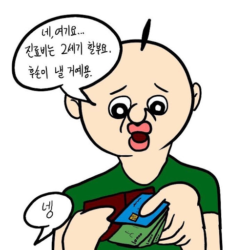

회사에 처음 들어온 지 반 년 정도가 지났다. 그동안 프로젝트의 완성도를 위해 끊임없이 이슈를 해결해왔다. 기능개발업무가 생기면 최선을 다했다. 그 과정에서 배울점도 많았다. 기획부터 디자인과 API를 거쳐 클라이언트까지, 그리고 돌아오는 소중한 CS까지도… 진행되는 일련의 과정들이 너무 재밌고, 뿌듯했다. 이런 과정들을 통해 프로젝트에 애정도 상당했다. 업무가 없을 때는 가시적인 이슈를 스스로 찾고 개선했다. 이슈티켓의 5할은 내가 발행했을 정도이다.

그런데, 지나고보니 기술부채가 잔뜩 쌓였다. nextjs, manifest 등 버전 최신화, cf도입, axios로직개선 등 무수한 레거시 코드들.. 상환해야할 기술부채가 많지만, **상환할 능력이 부족했다기 보다 기획진을 설득할 능력이 부족하다고 생각한다.** 상당수의 기술부채가 설득실패로 팔로업이 끊기곤 한다. 기획진은 끊임없는 인풋과 데드라인 속에서 우선순위를 산정한다. 그래서 필요에 의해 작업하는 것이 너무나도 이해가 된다. 문제는 **논의 없이 무작정 코드를 고쳤다가 이슈가 생기면 개발자의 책임이 된다.**  근데, **안고치고 가만히 있다가 발생하는 사용성 저하도 개발자에게 책임이 전가되기도 한다.** 그러므로, 기술부채를 마냥 손놓고 있을수도 없지만, 무작정 리팩토링을 시작하기도 힘들다. 어떻게 하면 좋을까? 요즘 내 최대 고민이다.

**어떤 일이 필요하지 않다면 진행되지 말아야 한다.** 즉, 목적없는 업무를 하지 않을 것. 기술부채도 그렇다고 생각한다. 그러므로, 기술부채를 해결하려면 **정말 소극적으로 접근해야 한다.** 정말 필요한 작업인지, 예상되는 사이드이펙트가 뭘지 스스로 인지해야한다. **메리트가 일부임에 비해 기존에 잘되던 기능이 안된다면 매우 곤란한 상황이 펼쳐질 것이다. 개발자의 신뢰가 하락할 것이고, 의견의 힘이 약해질 것이다.**  반대로, 개발자가 이전부터 충분히 신뢰를 쌓아왔다면 의견의 힘이 강해져 기술부채 상환 시기가 앞당겨질 수 있을 것이다. 이처럼, **기술부채 해결을 위해서는 신뢰가 매우 중요하다.**

사실 반대로 생각해보면, 일한지 6개월도 안된 꼬꼬마 개발자가 몇 년 된 프로덕트의 전체적인 레거시코드를 개선해야해! 하고 기획진을 설득한다는게 말도 안되는 이야기고 ㅋㅋ 당연히 위쪽에서 받아줄 리가 없다.  그러니, 기술부채 상환에 너무 조급해하지 말고, **먼저 주어진 일을 잘 처리함으로써 천천히 신뢰부터 쌓고, 작은 기술부채부터 설득하고 상환해나가는 것이 지금 나에게 주어진 상황에서 최선**이라 생각한다.

(총명 +1)
